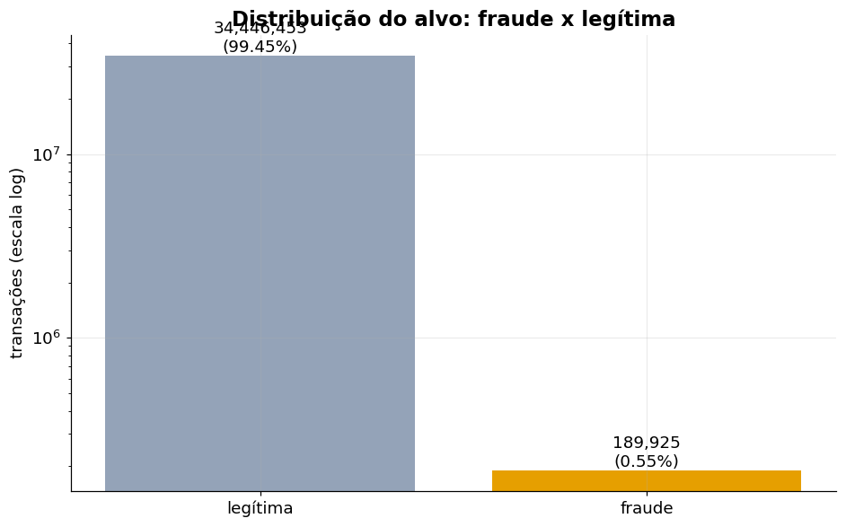
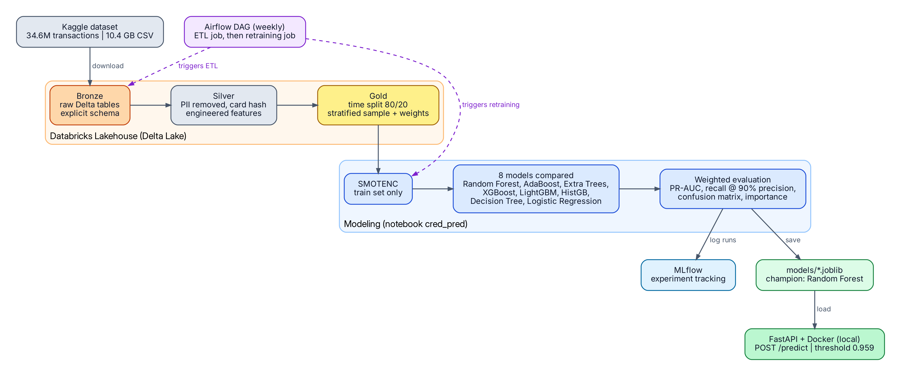
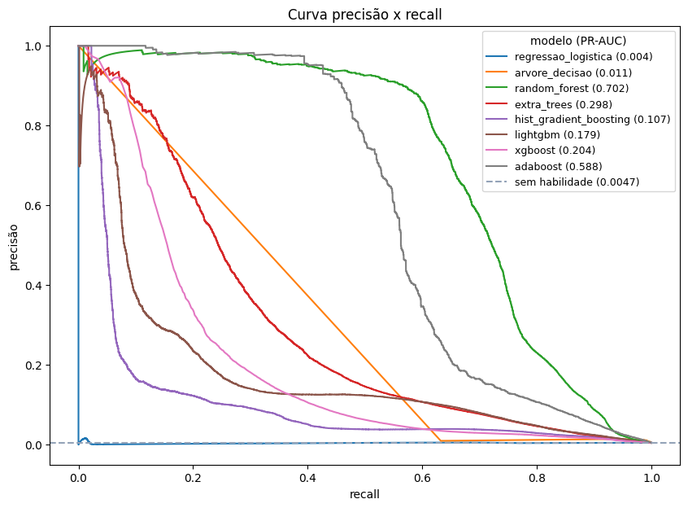
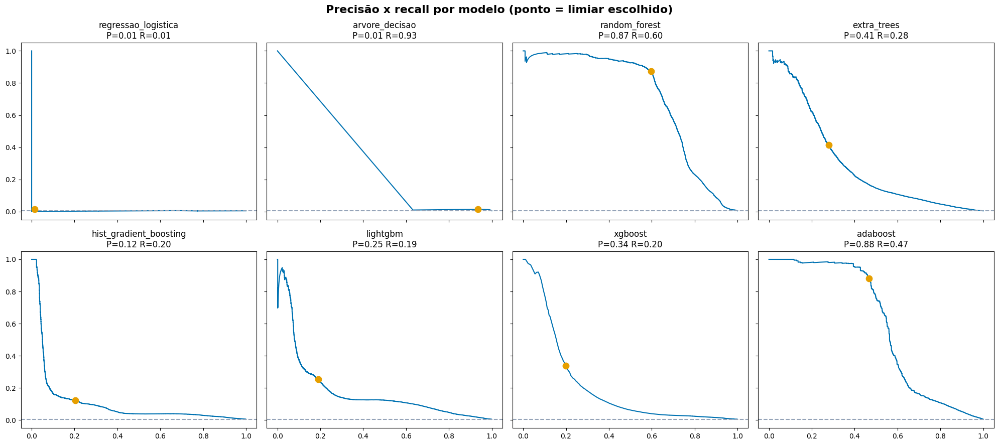
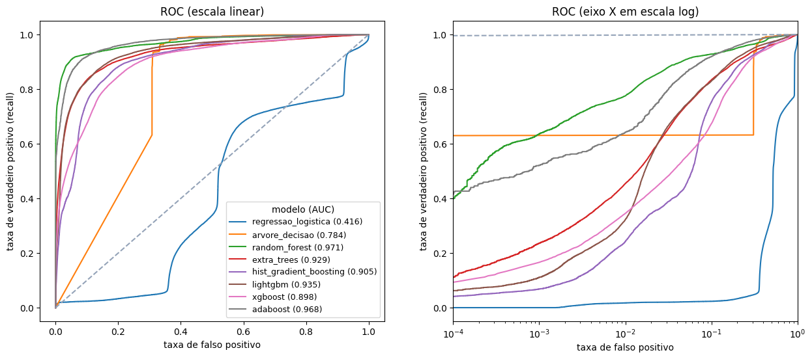
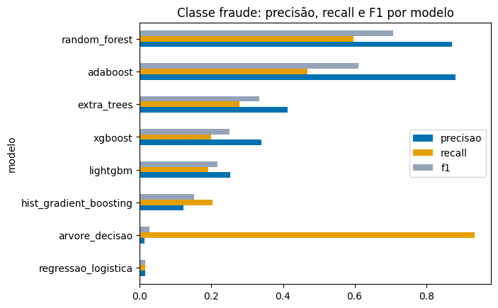
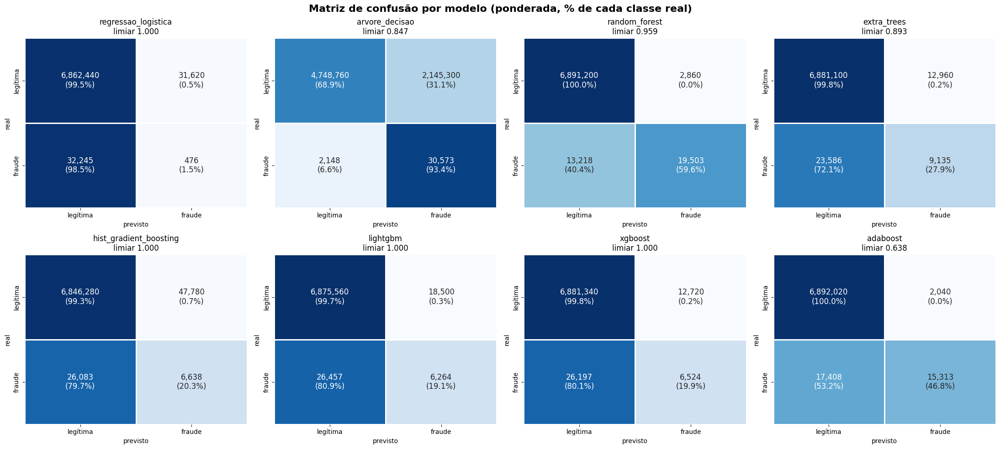
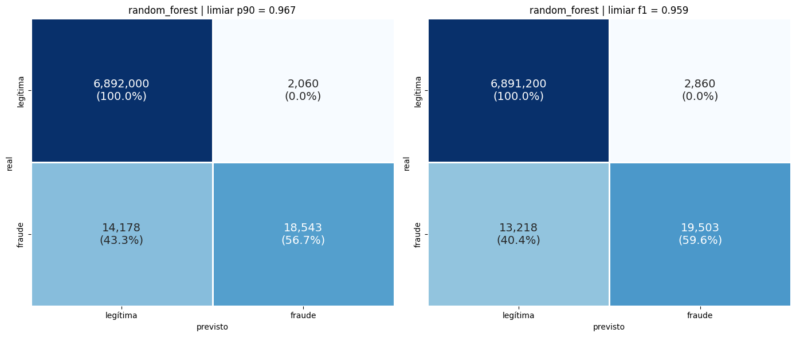
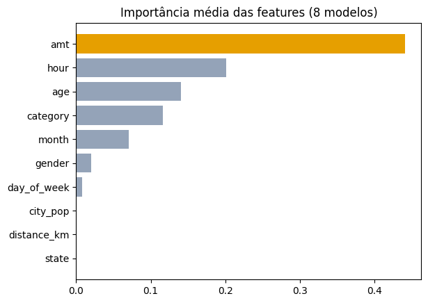
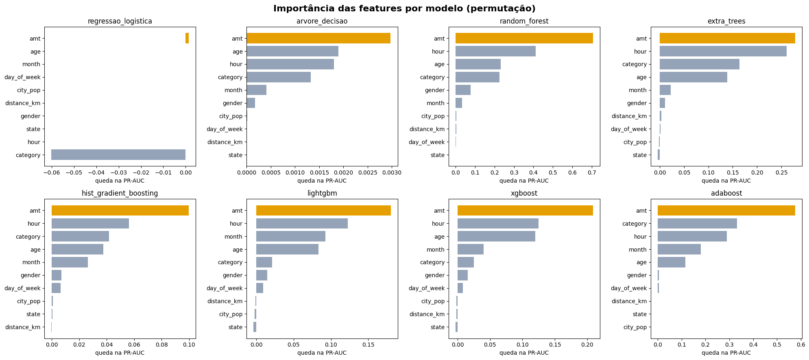

# Credit Card Fraud Detection: Data Engineering, Machine Learning and MLOps on Databricks


An end-to-end fraud detection project on **34.6 million credit card transactions (10.4 GB of CSV)**. It covers the whole lifecycle in three parts:

1. **Data engineering:** a medallion pipeline in Delta Lake with PII removal, a leakage-safe time split and reconciliation checks.
2. **Machine learning:** a comparison of 8 models trained on SMOTENC-balanced data, evaluated with weighted PR-AUC.
3. **MLOps:** experiment tracking with MLflow, a containerized scoring API and an Airflow DAG for scheduled retraining.

**Headline result:** a Random Forest reaches a weighted PR-AUC of **0.70** (a no-skill model scores 0.005). At a threshold that keeps precision at 90%, it catches **56.7% of frauds** while flagging only about 0.03% of legitimate transactions by mistake.

## Table of contents

- [Overview](#overview)
- [Part 1: Data engineering](#part-1-data-engineering)
- [Part 2: Machine learning](#part-2-machine-learning)
- [Part 3: MLOps](#part-3-mlops)
- [Repository structure](#repository-structure)
- [How to reproduce](#how-to-reproduce)
- [Limitations](#limitations)
- [Next steps](#next-steps)
- [Author](#author)

## Overview

Fraud is rare and expensive. The goal is to score each transaction with a fraud probability, so suspicious ones can be reviewed while false alarms (legitimate customers blocked by mistake) stay under control.

| Property | Value |
|----------|-------|
| Source | [Credit Card Fraud Mega Dataset](https://www.kaggle.com/datasets/karthikgangula/credit-card-fraud-mega-dataset) (Kaggle). Check the dataset page for its license before reuse |
| Files | `credit_card_fraud.csv` (10.42 GB, comma-separated) and `customers.csv` (20,000 rows, pipe-separated) |
| Rows | 34,636,378 transactions |
| Period | 2019-01-01 to 2020-12-31 |
| Target | `is_fraud`: 189,925 frauds (0.55%), about 1 fraud for every 181 legitimate transactions |



This imbalance drives three decisions in the project: a stratified sample that keeps every fraud, `sample_weight` to restore the real class proportion in metrics, and PR-AUC as the main metric. A model that always answers "legitimate" would be 99.45% accurate and completely useless.



---

## Part 1: Data engineering

### Layer contracts

| Layer | Table | Input | What happens | Output |
|-------|-------|-------|--------------|--------|
| Landing | Volume `workspace.bronze.raw_files` | Kaggle API | Idempotent download and unzip | Raw CSV files |
| Bronze | `workspace.bronze.transactions` | CSV | Read with explicit schema, no transformation | 34,636,378 rows, 27 columns |
| Bronze | `workspace.bronze.customers` | CSV (pipe) | Read with explicit schema and `sep="\|"` | 20,000 rows, 16 columns |
| Silver | `workspace.silver.transactions` | Bronze | Parse timestamp, drop PII, hash card, derive features | 34.6 M rows, 16 columns, no nulls |
| Gold | `workspace.gold.train` | Silver | Time split, all frauds plus 2% of legitimate rows, weights | 708,650 rows |
| Gold | `workspace.gold.test` | Silver | Time split, all frauds plus 5% of legitimate rows, weights | 377,424 rows |

The transactions file carries an unnamed index column (`Unnamed: 0`), renamed to `row_id` on ingestion because Delta does not accept that name without extra configuration.

**Silver schema**

| Column | Type | Origin |
|--------|------|--------|
| `trans_num` | string | transaction id |
| `customer_hash` | string | SHA-256 of `cc_num` |
| `event_time` | timestamp | `trans_date` + `trans_time` |
| `amt` | double | amount |
| `category`, `merchant`, `state`, `gender`, `job` | string | attributes kept for analysis |
| `city_pop` | int | city population |
| `age` | bigint | age at the time of the transaction, from `dob` |
| `distance_km` | double | haversine distance between customer and merchant |
| `hour`, `day_of_week`, `month` | int | derived from `event_time` |
| `is_fraud` | int | target |

The gold tables add `sample_weight` (1 / sampling fraction for legitimate rows, 1 for frauds).

**Gold sampling**

| Split | Rows | Frauds | Legitimate | Period |
|-------|------|--------|------------|--------|
| Train | 708,650 | 157,204 | 551,446 | 2019-01-01 to 2020-08-23 |
| Test | 377,424 | 32,721 | 344,703 | 2020-08-23 to 2020-12-31 |

### Engineering decisions

| Decision | Why |
|----------|-----|
| Explicit schema instead of `inferSchema` | Inference reads the whole file. On 10 GB that costs compute quota and can silently mis-type columns |
| Delta tables from bronze onward | ACID writes, schema enforcement and fast metadata queries |
| Raw files in a Unity Catalog Volume | Keeps the original data governed and re-processable without going back to the source |
| Download through the Kaggle API inside Databricks | The workspace UI upload is capped at 2 GB, so the 10.4 GB file could not be uploaded by hand |
| Idempotent download | The step skips files that already exist in the volume, so re-runs cost nothing |
| Drop PII and hash the card number in silver | Downstream layers and models never see identifying fields. The hash still allows grouping by customer |
| Time split before sampling | A random split would mix future transactions into training. Sampling after the split keeps the test period untouched |
| `sampleBy` with all frauds and a fraction of legitimate rows | 34 million rows are unnecessary to learn fraud patterns, and keeping every fraud preserves the rare class |
| `sample_weight` column | Metrics on the sample can be re-weighted to the real class proportion |
| Overwrite writes with a fixed seed | Re-running a layer rebuilds it deterministically |
| No full scans during development | Counts and schema inference on the 10 GB file are done once, and validation runs on Delta tables |

### Data quality and reconciliation

| Check | Layer | Result |
|-------|-------|--------|
| Row count | Bronze | 34,636,378 |
| Class balance | Bronze | 34,446,453 legitimate and 189,925 fraud (0.55%) |
| Nulls in 16 columns | Silver | 0 in every column, which also confirms the date and time parsing worked |
| Fraud count reconciliation | Gold | 157,204 (train) + 32,721 (test) = 189,925, equal to the bronze total |
| Legitimate count reconciliation | Gold | 551,446 / 0.02 and 344,703 / 0.05 rebuild about 34.46 M, matching bronze |
| Time ranges | Gold | Train and test periods do not overlap |
| Duplicate transaction ids | Silver | Exact check on `trans_num` is in the silver notebook. `my_transformation.py` has a `DEDUPLICAR` switch |

### Working within Free Edition limits

The workspace has no classic clusters, a 2 GB UI upload limit and a daily serverless compute quota. Heavy steps run alone, aggregations stay in Spark with only small summaries brought to pandas, and model training uses a stratified sample of about 1.1 million rows instead of 34.6 million.

### Security and governance

- **PII:** SSN, name and street are never written to silver or gold. The card number is replaced by a SHA-256 hash. The hash has no salt, which is acceptable for a portfolio project but not for production.
- **Credentials:** the Kaggle token is typed at runtime and never saved in a notebook.
- **Governance:** tables live in Unity Catalog under the `workspace` catalog, with one schema per medallion layer.
- **Raw data stays out of Git:** CSV files and large model files are excluded through `.gitignore`.

---

## Part 2: Machine learning

### Setup

**Features:** `category`, `state`, `gender`, `amt`, `city_pop`, `age`, `distance_km`, `hour`, `day_of_week`, `month`. High-cardinality columns (`merchant`, `job`) were left out to keep SMOTENC tractable.

**Class balancing:** SMOTENC, applied once to the training set only, raising the fraud class to 50% of the legitimate count. SMOTENC is used instead of plain SMOTE because the data has categorical columns. The test set is never resampled. The 8 models were trained without class weights, so the effect measured is the one from SMOTENC.

**Models compared (8):** Logistic Regression, Decision Tree, Random Forest, Extra Trees, HistGradientBoosting, LightGBM, XGBoost and AdaBoost.

**Evaluation.** All metrics use the untouched test set with `sample_weight`:

- **PR-AUC (main metric):** with 0.55% fraud, accuracy and ROC-AUC look good for almost any model and hide the differences.
- **Recall at 90% precision:** how many frauds are caught while keeping false accusations low.
- **Precision, recall and F1 of the fraud class** at the best-F1 threshold.
- **Per-model decision thresholds.** Balanced training inflates predicted probabilities, so the default 0.5 cutoff does not apply.

### Results

Metrics are weighted to the real class proportion of the test set. The no-skill PR-AUC baseline is 0.0047, the real fraud rate in the test period.

| Model | PR-AUC | ROC-AUC | Recall @ 90% precision | Fit time (s) |
|-------|--------|---------|------------------------|--------------|
| **Random Forest** | **0.7025** | **0.9705** | **0.5667** | 18.0 |
| AdaBoost | 0.5883 | 0.9683 | 0.4595 | 186.8 |
| Extra Trees | 0.2978 | 0.9291 | 0.0885 | 8.2 |
| XGBoost | 0.2044 | 0.8981 | 0.0771 | 4.9 |
| LightGBM | 0.1791 | 0.9350 | 0.0323 | 5.3 |
| HistGradientBoosting | 0.1067 | 0.9049 | 0.0292 | 4.2 |
| Decision Tree | 0.0106 | 0.7841 | 0.0000 | 6.1 |
| Logistic Regression | 0.0039 | 0.4156 | 0.0000 | 2.4 |







ROC curves include a log-scale X axis on the right because fraud is so rare that the relevant region sits next to the left edge.

**Fraud class at the best-F1 threshold**

| Model | Threshold | Precision | Recall | F1 |
|-------|-----------|-----------|--------|----|
| **Random Forest** | 0.959 | 0.8721 | 0.5960 | 0.7081 |
| AdaBoost | 0.638 | 0.8824 | 0.4680 | 0.6116 |
| Extra Trees | 0.894 | 0.4134 | 0.2792 | 0.3333 |
| XGBoost | 1.000 | 0.3390 | 0.1994 | 0.2511 |
| LightGBM | 0.999 | 0.2529 | 0.1914 | 0.2179 |
| HistGradientBoosting | 0.999 | 0.1220 | 0.2029 | 0.1524 |
| Decision Tree | 0.847 | 0.0141 | 0.9344 | 0.0277 |
| Logistic Regression | 0.999 | 0.0148 | 0.0145 | 0.0147 |



### Confusion matrices



Champion model (Random Forest) at both thresholds. Counts are weighted estimates of the real test period.



| Threshold | Frauds caught | Frauds missed | False alarms |
|-----------|---------------|---------------|--------------|
| 90% precision (0.967) | 18,543 (56.7%) | 14,178 | 2,060 |
| Best F1 (0.959) | 19,503 (59.6%) | 13,218 | 2,860 |

### Feature importance

Permutation importance on the test set, measured as the drop in weighted PR-AUC when each column is shuffled.





`amt`, `hour`, `age` and `category` carry most of the signal in every tree-based model. `city_pop`, `distance_km` and `state` contribute almost nothing, which is surprising for `distance_km` and probably reflects how this dataset was generated.

### Conclusions

- **Random Forest is the champion**, with a PR-AUC about 150 times the no-skill baseline and the best recall at 90% precision (56.7%).
- **AdaBoost is a clear second**, with similar precision but lower recall and a 10x longer fit time.
- **Boosted models underperformed** (PR-AUC between 0.11 and 0.20, with best thresholds at about 1.0). A likely explanation is that these high-capacity models overfit the synthetic SMOTENC frauds and produce saturated probabilities. This was not verified, and a run with class weights instead of SMOTENC is the way to confirm it.
- **Logistic Regression is not a valid baseline here:** its ROC-AUC of 0.42 is below chance, which points to a pipeline or distribution problem rather than a real signal.
- **The Decision Tree** has very few distinct leaf probabilities, so its precision-recall curve is almost a straight line and no threshold reaches 90% precision.

---

## Part 3: MLOps

### Status

| Component | Status |
|-----------|--------|
| Experiment tracking with MLflow (parameters and metrics per model) | Done |
| Model export as `.joblib` pipelines (preprocessor plus model) | Done |
| Top models exported in MLflow format (`mlflow/modelos/`) | Done |
| Scoring API (FastAPI) and Docker image | Implemented |
| Airflow DAG for ETL and retraining | Designed, not yet run against a workspace |
| Databricks Jobs for the DAG to trigger | To be created |
| Champion registration in the Unity Catalog model registry | Pending |

### Experiment tracking

Each model is logged as an MLflow run with its balancing strategy, weighted PR-AUC, ROC-AUC, recall at 90% precision and fit time. Experiments are stored in the workspace under `mlflow/`. Saved pipelines include the fitted preprocessor, so they accept the original columns and never depend on a separate encoder file.

### Scoring API with Docker

A FastAPI service loads the saved pipeline once at startup and returns a fraud probability per transaction.

```bash
docker build -f docker/Dockerfile -t cred-pred .
docker run -p 8000:8000 -v "$(pwd)/models:/models" \
  -e MODELO_PATH=/models/smotenc/random_forest.joblib \
  -e LIMIAR=0.959 cred-pred
```

On PowerShell, use `${PWD}` instead of `$(pwd)` and put the command on one line. Open `http://localhost:8000/docs` for the Swagger UI. Example request:

```bash
curl -X POST http://localhost:8000/predict \
  -H "Content-Type: application/json" \
  -d '{"category": "CATEGORY", "state": "STATE", "gender": "F", "amt": 250.0, "city_pop": 50000, "age": 41, "distance_km": 80.5, "hour": 2, "day_of_week": 6, "month": 11}'
```

Replace `CATEGORY` and `STATE` with real values from the dataset. Example response:

```json
{"probabilidade_fraude": 0.97, "fraude": true, "limiar": 0.959}
```

- **Threshold:** `LIMIAR` is the decision threshold. Use 0.959 (best F1) or 0.967 (90% precision), taken from the weighted precision-recall curve, not 0.5.
- **Models stay outside the image:** they are mounted at run time, so switching models only requires changing `MODELO_PATH`.
- **Pinned versions:** scikit-learn 1.6.1, pandas 2.2.3, numpy 2.1.3, joblib 1.4.2. The `.joblib` files are pickles, so load only files you created yourself and use the same versions.

### Orchestration and retraining

An Airflow DAG (`airflow/dags/retreino_fraude.py`) is designed to run weekly and trigger two Databricks Jobs in order, using `DatabricksRunNowOperator`:

1. `my_transformation.py`: bronze, silver and gold. It has a `RECRIAR_BRONZE` switch (off by default, because reading the 10 GB CSV is the most expensive step) and a `DEDUPLICAR` switch.
2. A retraining script that fits the champion model with SMOTENC.

The challenger replaces the champion only if its test PR-AUC beats the current model by a small margin (0.002), which avoids swaps caused by noise. The previous model is kept as a timestamped backup, and every run is appended to a retraining history.

The connection to Databricks uses a personal access token stored only in the Airflow connection `databricks_default`. The token is never committed. Whether the Free Edition allows API tokens and the Jobs API is not confirmed.

---

## Repository structure

```
.
├── SQL/                  # analytical queries
├── airflow/              # DAGs for scheduled ETL and retraining
├── app/                  # FastAPI scoring service
├── data/                 # small local samples
├── docker/               # Dockerfile and API requirements
├── img/                  # figures used in this README
├── lake/                 # lakehouse artifacts
├── mlflow/modelos/       # models saved in MLflow format
├── models/               # trained models (.joblib)
├── notebook/             # Databricks notebooks
├── src/                  # pipeline source (transformations)
├── Dockerfile
├── main.py
├── requirements.txt
└── README.md
```

| Notebook | Purpose |
|----------|---------|
| `01_setup` | Catalog, schemas and the raw files volume |
| `02_download_kaggle` | Idempotent download and extraction into the volume |
| `03_inspecao` | Schema and sample inspection |
| `04_bronze` | CSV to Delta with explicit schemas |
| `05_silver` | PII removal, hashing and feature engineering |
| `06_gold` | Time split, stratified sampling and weights |
| `cred_pred` | Exploratory analysis, modeling, evaluation and model export |

## How to reproduce

1. Create a Databricks workspace (the Free Edition is enough, with limited compute).
2. Run the notebooks in `notebook/` in order, starting with `01_setup`.
3. Provide your Kaggle credentials at runtime in `02_download_kaggle`. Do not commit them.
4. Run the exploratory analysis and modeling in `cred_pred`.
5. Download `models/smotenc/random_forest.joblib` and start the API with Docker.
6. Optional: create the two Databricks Jobs and the Airflow DAG for scheduled runs.

## Limitations

- **Static, likely synthetic data.** The records look generated, so results do not transfer directly to a real card portfolio, and there is no real incremental load to demonstrate.
- **Threshold tuned on the test set.** Reported precision and recall are slightly optimistic. A rigorous setup would pick the threshold on a separate validation period.
- **Inflated probabilities.** Balanced training overestimates fraud probability, so scores are useful for ranking but not as calibrated risk.
- **Weighted estimates.** Test metrics come from a 5% sample of legitimate rows, so they carry sampling noise, and the counts in the confusion matrices are estimates.
- **Model comparison is partly unexplained.** Boosted models and Logistic Regression perform far below Random Forest, and the cause was not isolated.
- **Seasonality feature.** `month` ranks among the top features, but the test months (September to December 2020) are only seen in training from 2019. It may be a real seasonal pattern or a dataset artifact.
- **Sensitive attributes.** `age` and `gender` are model inputs. In a real credit decision they raise fairness and regulatory questions.
- **Engineering gaps.** Tables are not partitioned or optimized, there are no automated data quality tests or CI, and the card hash has no salt.

## Next steps

**Data engineering**

- Rebuild the pipeline as Lakeflow Declarative Pipelines with `expectations` for declarative data quality rules.
- Move ingestion to Auto Loader for incremental file arrival.
- Partition silver by month and apply `OPTIMIZE` with Z-ordering on `customer_hash`.
- Add automated tests (schema, nulls, uniqueness and reconciliation) and a GitHub Actions workflow.

**Machine learning**

- Run the same 8 models with class weights instead of SMOTENC and compare the two strategies.
- Investigate why boosted models and Logistic Regression underperform, and tune the strongest candidates.
- Add `merchant` and `job` with target or frequency encoding.
- Choose the threshold on a validation period and report on the test period only.
- Run an ablation without `month`, `age` and `gender`.

**MLOps**

- Register the champion in the Unity Catalog model registry and serve it from a Databricks endpoint.
- Create the Databricks Jobs and run the Airflow DAG end to end.
- Add monitoring for data drift, score distribution and row counts per layer.

## Author

**Rafael Gallo**

[GitHub](https://github.com/RafaelGallo) · [LinkedIn](ADD_YOUR_LINKEDIN_URL)
